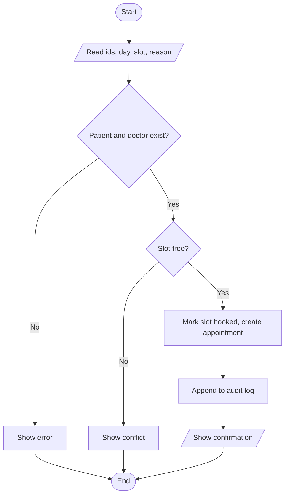

# ClinicAppointmentManager – Topic-wise Notes for Viva

**Problem:** A small clinic books appointments on paper, causing double bookings and lost records.
**Solution:** A console Java app that registers patients, books/cancels appointments, blocks slot conflicts, tracks status, saves data to files and prints a report.

Run: `javac *.java` then `java ClinicAppointmentManager` (Java 11+).

---

## 1. Problem solving: Algorithm & Flowchart (topic: computational thinking)

**Algorithm – Book an appointment**
1. Read patient id, doctor id, day, slot, reason.
2. If patient or doctor does not exist → show error, stop.
3. If the doctor's slot is already booked → show conflict, stop.
4. Mark the slot as booked, create the appointment, add to list.
5. Write a line to the audit log, display confirmation.

**Why:** Viva always starts with "how did you plan before coding?" Planning the logic first avoids mistakes in the code.

---

## 2. Topic → File → Why used

| # | Topic | Where in code | Why used (say this in viva) |
|---|---|---|---|
| 1 | Primitive types, variables | `int`, `double`, `char`, `boolean` across files | `int` for ids/slots, `double` for fees, `boolean` for free/booked checks |
| 2 | Constants (`final static`), identifiers | `Constants.java` | One place to change days/slots/start hour; no magic numbers |
| 3 | Operators: arithmetic, relational, logical | `Validator`, `ScheduleGrid.timeLabel` (`START_HOUR + slot`) | Time calculation, range checks (`>=`, `&&`, `\|\|`) |
| 4 | Ternary, unary, assignment (`+=`, `++`) | `statusText()`, `counter++`, `revenue +=` | Short status labels, counters, running totals |
| 5 | **Bitwise operators** | `Appointment.setFlag/clearFlag/hasFlag` | Confirmed / Paid / Follow-up stored in ONE int: `\|=` sets, `& ~` clears, `&` tests. Saves fields and shows bit logic |
| 6 | Special operator `instanceof` | not forced; mention `Person` types if asked | Optional – only used if you add type checks |
| 7 | Typecasting | `ClinicService.report()`: `(double) paidCount * 100 / total` | Without the cast, int division gives 0 |
| 8 | Precedence/associativity | `(double) paidCount * 100 / total` | Cast binds first, then `*` and `/` left to right |
| 9 | Console I/O, `printf`, `Scanner` | `ClinicAppointmentManager.java` | Read typed input (`nextLine`), aligned table output with `%-16s %d %.2f` |
| 10 | if / if-else / else-if ladder | case 4 in `handle()`, `Validator` | Choosing the status flag, validation |
| 11 | switch (default, break) | `handle()` menu | Menu has many fixed options → cleaner than long if-else |
| 12 | do-while | main menu loop | Menu must show at least once |
| 13 | for, enhanced for, nested loops | `ScheduleGrid.add/render`, lookups | Traverse day × slot grid; for-each when index not needed |
| 14 | while | `FileStore.readLines` | Read until `readLine()` returns null |
| 15 | Methods, parameters, return values | everywhere (`askInt`, `book`) | Modular code, each method does one job |
| 16 | **Method overloading** | `Validator.inRange(int…)` / `inRange(double…)`; constructors | Same operation for different types |
| 17 | **Recursion** | `ScheduleGrid.nextFreeSlot` | Base cases: past last slot (-1) / free slot found. Recursive case: try next slot |
| 18 | 1D arrays: traversal, sum, count, average, search | `report()`: `perDoctor[]`, revenue, avg fee; `findAppointment` | Counting appointments per doctor, totals, average fee, busiest doctor |
| 19 | **2D arrays / matrix arithmetic** | `Doctor.grid`, `ScheduleGrid.add` | Each doctor's week = days × slots matrix. Adding all matrices = clinic load |
| 20 | Classes, objects, `new`, null | `Patient`, `Doctor`, `Appointment`; `find…` returns `null` | Real-world things → objects; null means "not found" |
| 21 | Constructors, overloading, `this` | `Patient(...)` two versions, `this(++counter, …)` | One for loading from file (id known), one for new patients (auto id) |
| 22 | Encapsulation | private fields + getters; `Doctor.getGridCopy()` | Outside code can't corrupt the timetable |
| 23 | `static` members | `Patient.counter`, `Constants`, utility classes | One shared counter for ids; helpers need no object |
| 24 | `toString()` | all entity classes | Readable printing |
| 25 | **Inheritance, overriding** | `Person` → `Patient`, `Doctor`; `role()` abstract, `toString()` overridden | Patient and Doctor share id/name/phone ("is-a Person") |
| 26 | **Interface, program to interface** | `Reportable`; `printAll(List<? extends Reportable>)` | One print method for patients, doctors, appointments |
| 27 | **Exceptions**: checked/unchecked, try-catch-finally, multi-catch, throw, throws | `InvalidInputException`, `SlotConflictException`; `NumberFormatException` in `Validator.parseInt`; `Appointment.fromRecord` multi-catch; `finally` in `main` | Bad input / double booking / bad file lines must not crash the app |
| 28 | **Strings**: trim, split, join, contains, toLowerCase, replace, immutability | `Validator`, `searchPatients`, `toRecord/fromRecord` | Clean input, case-insensitive search, file record building/parsing |
| 29 | `equals()` vs `==` | use `equalsIgnoreCase` for text; `==` only for ints | `==` compares references for objects; `equals` compares content |
| 30 | **StringBuilder** | `report()`, `ScheduleGrid.render` | Many appends; plain `+` would create many new String objects (Strings are immutable) |
| 31 | `Arrays.sort / binarySearch`, `Collections.sort` | `findAppointment`, `scheduleByTime` | Binary search is fast but needs sorted data, so we sort by id first |
| 32 | **Comparable & Comparator** | `Appointment.compareTo` (day, slot); `AppointmentComparators` | Comparable = ONE natural order; Comparator = extra orders (by id, by doctor) |
| 33 | **File I/O** `Path`, `Files`, `BufferedReader/Writer`, try-with-resources, append | `FileStore.java` | Data survives restart; `append` for audit log; resources close automatically |
| 34 | Missing file / malformed records | `FileStore.readLines` (exists check), `ClinicService.load()` | First run has no files; bad lines are skipped and counted |

**Topics deliberately NOT used:** StringBuffer (StringBuilder is enough, no threads), interfaces with multiple inheritance, Streams – not needed and not in the syllabus.

---

## 3. Likely viva questions (short answers)

1. **Why abstract `Person`?** A plain "Person" is never created; it only holds common data. `role()` forces each subclass to define itself.
2. **Why checked exceptions?** Invalid input and slot conflicts are expected situations the caller must handle.
3. **Why does `Appointment` implement `Comparable`?** So `Collections.sort(list)` knows the default order (day, then slot).
4. **Why return a copy in `getGridCopy()`?** Returning the real array would let any class change bookings without going through `book()`.
5. **Why `final` fields?** An id or the slot should not change after the object is created.
6. **Why sort before `Arrays.binarySearch`?** Binary search gives wrong results on unsorted data.
7. **`String` vs `StringBuilder`?** String is immutable; StringBuilder is mutable and faster for repeated appends.
8. **What does `flags &= ~flag` do?** `~flag` flips the bits, `&` keeps all other bits and turns this one off.
9. **Why try-with-resources?** The reader/writer/Scanner closes automatically even if an exception occurs.
10. **What is the base case in your recursion?** `slot >= SLOTS` (return -1) or the slot is free (return slot).
